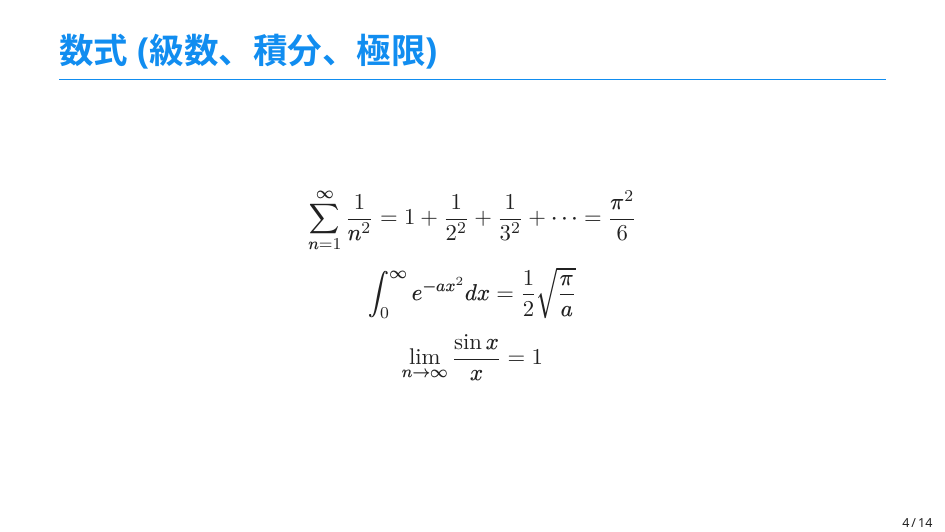

# 日本語の Beamer 用テンプレート




## 概要
- Lua$\LaTeX$ と Latexmk を使って作成しています
- フォントは Noto Sans CJK JP を使っています
- [サンプルのPDF](./out/main.pdf)

## 使い方
```
$ latexmk main.tex
```

## 参考にさせていただきました
- [SimplePlus-BeamerTheme](https://github.com/PM25/SimplePlus-BeamerTheme)